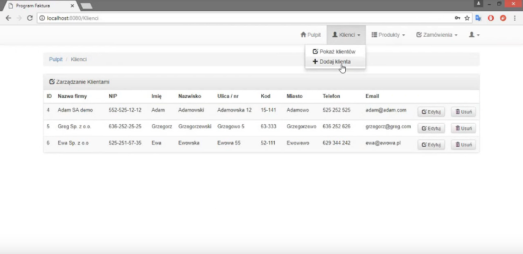

# WebFaktura
#### Java EE, Servlets, JSP, JSTL, SQLite, ORM, Bootstrap, HTML, CSS

Java Enterprise practice based on Java EE, Servlets, JSP, JSTL library, relational SQLite database, Object-Relational Mapping, Bootstrap, HTML5, CSS3

### Youtube demo

